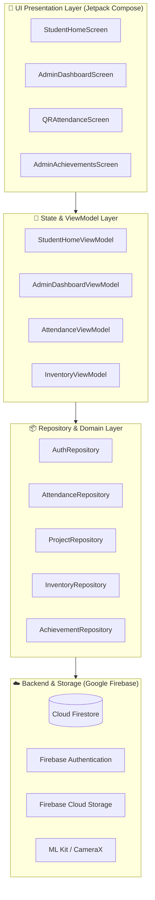

<div align="center">

# 🤖 Robotics Wala Hub (RW HUB)

### *Enterprise-Grade Cyber-Robotics Lab Management & Research Ecosystem*

[](https://github.com/Raj80965/RoboticsWalaHub/actions)
[](https://kotlinlang.org)
[](https://developer.android.com)
[](https://opensource.org/licenses/MIT)
[](https://github.com/Raj80965/RoboticsWalaHub/releases)

<br/>

[📥 Download APK (Direct)](https://raj80965.github.io/RoboticsWalaHub/RW_HUB.apk) • [🌐 Live Web Simulator](https://raj80965.github.io/RoboticsWalaHub/) • [📖 User Guide](USER_GUIDE.md) • [🐛 Report Bug](https://github.com/Raj80965/RoboticsWalaHub/issues/new?template=bug_report.yml)

</div>

---

## 📑 Table of Contents

- [Overview](#-overview)
- [Key Features](#-key-features)
- [System Architecture](#-system-architecture)
- [Tech Stack](#-tech-stack)
- [Project Directory Structure](#-project-directory-structure)
- [Getting Started & Build Instructions](#-getting-started--build-instructions)
- [Firebase Configuration](#-firebase-configuration)
- [Web Simulator](#-web-simulator)
- [Contributing](#-contributing)
- [Security](#-security)
- [Changelog](#-changelog)
- [License & Credits](#-license--credits)

---

## 🌟 Overview

**Robotics Wala Hub (RW HUB)** is a comprehensive, production-ready Android mobile application and web-based management platform built specifically for university robotics laboratories, makerspaces, innovation centers, and hardware research clubs.

It bridges the gap between hardware researchers and lab administrators by digitizing all laboratory operations:
- **Zero-paper administration** for attendance, lab access, and equipment allocations.
- **Role-based isolation** between students/researchers and professors/lab in-charges.
- **Real-time collaboration** on multi-member robotics engineering projects.
- **Automated hardware inventory tracking** preventing stock loss and bottlenecking.

---

## 🚀 Key Features

<table>
  <tr>
    <td width="50%">
      <h3>🔐 Authentication & Role Isolation</h3>
      <ul>
        <li>Secure Firebase Authentication with email & password.</li>
        <li>Approval-gated student onboarding (Pending, Approved, Suspended).</li>
        <li>Dedicated dashboards tailored for Students vs. Admins.</li>
      </ul>
    </td>
    <td width="50%">
      <h3>📷 Digital QR Attendance Engine</h3>
      <ul>
        <li>Lightning-fast QR scanning via <b>Google ML Kit + CameraX</b>.</li>
        <li>Dynamic attendance QR generation using <b>ZXing</b> for faculty.</li>
        <li>Automated lab work hours calculation and duplicate prevention.</li>
      </ul>
    </td>
  </tr>
  <tr>
    <td width="50%">
      <h3>🗓️ Lab Slot & Bench Scheduling</h3>
      <ul>
        <li>Interactive workstation and equipment booking calendar.</li>
        <li>Automated conflict detection prevents overlapping reservations.</li>
        <li>Admin one-click approval, rescheduling, and cancellation alerts.</li>
      </ul>
    </td>
    <td width="50%">
      <h3>⚙️ Hardware & Tool Inventory</h3>
      <ul>
        <li>Catalog for microcontrollers (ESP32, STM32, Arduino), sensors, actuators.</li>
        <li>Atomic checkout & return system with real-time stock deductions.</li>
        <li>Low-stock triggers and overdue equipment tracking.</li>
      </ul>
    </td>
  </tr>
  <tr>
    <td width="50%">
      <h3>🏆 Continuous Achievement Showcase</h3>
      <ul>
        <li>Dynamic sliding image showcase on student dashboard.</li>
        <li>Admin photo upload pipeline with instant live broadcast.</li>
        <li>Digital certificate portfolio with gamification points & badges.</li>
      </ul>
    </td>
    <td width="50%">
      <h3>🚀 Projects, Tasks & Budget Tracker</h3>
      <ul>
        <li>Multi-student team milestones with progress tracking.</li>
        <li>Weekly milestone submission and faculty review workflow.</li>
        <li>Bill & expense receipt upload with automated balance auditing.</li>
      </ul>
    </td>
  </tr>
</table>

---

## 🏛️ System Architecture

RW HUB strictly adheres to the modern Android **MVVM (Model-View-ViewModel)** architectural pattern with Google's recommended **Clean Architecture** principles.



---

## 🛠️ Tech Stack

### Android Application


### Backend & Cloud Services


### Web Simulator & CI/CD


---

## 📁 Project Directory Structure

```text
RoboticsWalaHub/
├── .github/
│   ├── ISSUE_TEMPLATE/
│   │   ├── bug_report.yml            # Interactive bug report form
│   │   ├── feature_request.yml       # Interactive feature suggestion form
│   │   └── config.yml                # Template community configuration
│   ├── workflows/
│   │   └── build-apk.yml             # Automated Android build CI pipeline
│   ├── FUNDING.yml                   # Sponsorship config
│   └── PULL_REQUEST_TEMPLATE.md      # Standard PR checklist
├── app/
│   ├── src/main/
│   │   ├── java/com/roboticswala/hub/
│   │   │   ├── data/                 # Models, repositories, Firebase mappers
│   │   │   ├── ui/
│   │   │   │   ├── components/       # Custom Compose widgets & carousels
│   │   │   │   ├── screens/
│   │   │   │   │   ├── admin/        # Admin Command Center screens & tabs
│   │   │   │   │   ├── auth/         # Login, Registration, Splash
│   │   │   │   │   └── student/      # Student Dashboard, Attendance, Tasks
│   │   │   │   └── theme/            # Obsidian Cyber-Robotics M3 theme
│   │   │   └── MainActivity.kt       # Single-activity navigation root
│   │   └── res/                      # Icons, XML layouts, themes, mipmaps
│   └── build.gradle.kts              # Module-level Gradle configuration
├── firestore.rules                   # Production Firestore security rules
├── storage.rules                     # Cloud Storage security rules
├── index.html                        # Interactive Zero-Install Web Simulator
├── preview.html                      # Standalone simulator mirror
├── RW_HUB.apk                        # Compiled direct-download release binary
├── RoboticsWalaHub.apk               # Backup direct-download release binary
├── CHANGELOG.md                      # Detailed version history
├── CODE_OF_CONDUCT.md                # Contributor Covenant v2.1
├── CONTRIBUTING.md                   # Contribution workflow & guidelines
├── LICENSE                           # MIT Open-Source License
├── SECURITY.md                       # Vulnerability reporting policy
├── USER_GUIDE.md                     # Step-by-step bilingual manual
└── README.md                         # Main repository presentation
```

---

## 💻 Getting Started & Build Instructions

### Prerequisites
- **Android Studio** Ladybug (2024.2.1+) or newer
- **JDK 17** or **JDK 21** configured in JAVA_HOME
- **Android SDK Platform** 35 with Build Tools 35.0.0
- **Git**

### Clone & Open
```bash
# Clone the repository
git clone https://github.com/Raj80965/RoboticsWalaHub.git

# Navigate into project directory
cd RoboticsWalaHub
```

### Build with Gradle
```bash
# Assemble Debug APK
./gradlew assembleDebug

# Output APK path:
# app/build/outputs/apk/debug/app-debug.apk
```

---

## 🔥 Firebase Configuration

To configure your own Firebase project:
1. Create a project in the [Firebase Console](https://console.firebase.google.com/).
2. Add an **Android App** with package name `com.roboticswala.hub`.
3. Download `google-services.json` and place it inside the `app/` directory.
4. Enable **Authentication** (Email/Password).
5. Enable **Cloud Firestore** and deploy [`firestore.rules`](firestore.rules).
6. Enable **Cloud Storage** and deploy [`storage.rules`](storage.rules).

---

## 🌐 Web Simulator

Can't install the APK right now? RW HUB includes a high-fidelity, interactive **Web Simulator** that runs in any modern browser without needing Android Studio or an emulator:

- **Launch Simulator Online:** [https://raj80965.github.io/RoboticsWalaHub/](https://raj80965.github.io/RoboticsWalaHub/)
- **Run Locally:** Simply double-click [`index.html`](index.html) or run a local HTTP server:
  ```bash
  npx serve .
  ```

---

## 🤝 Contributing

Contributions are what make the open-source community an amazing place to learn, inspire, and create. Any contributions you make are **greatly appreciated**!

1. Check out our [Contribution Guidelines](CONTRIBUTING.md).
2. Familiarize yourself with our [Code of Conduct](CODE_OF_CONDUCT.md).
3. Fork the project and submit a Pull Request using our [PR Template](.github/PULL_REQUEST_TEMPLATE.md).

---

## 🛡️ Security

If you discover any security issues or vulnerabilities, please review our [Security Policy](SECURITY.md) before opening any public reports.

---

## 📜 Changelog

For a complete breakdown of version history and recent additions (including the v2.1.0 sliding achievement banner), see [CHANGELOG.md](CHANGELOG.md).

---

## 📄 License & Maintainer

Distributed under the **MIT License**. See [`LICENSE`](LICENSE) for more details.

**Lead Maintainer:** [@Raj80965](https://github.com/Raj80965)  
**Project:** Robotics Wala Hub (RW HUB) 🤖

<div align="center">
  <sub>Built with ❤️ for robotics clubs, student engineers, and future innovators.</sub>
</div>
